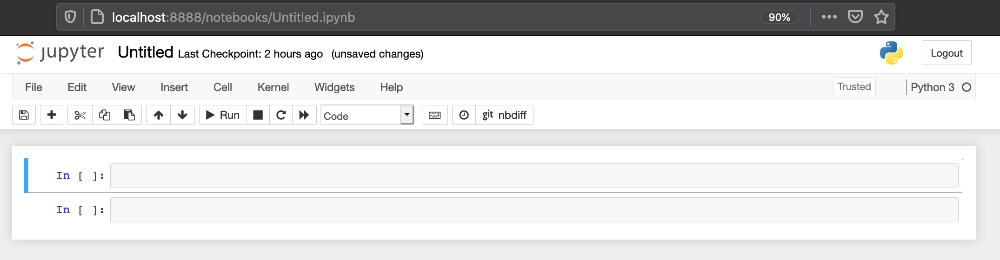

# Installation

I am sure you are anxious to install Jupyter and start exploring its capabilities, but first you have to decide if you want to install the Jupyter Notebook server directly on your system or host it on a virtual machine or a docker container.

I believe it is important to give you the options so that you feel comfortable running the tool however you feel like it. If you want to do a classic install directly on your system, follow the [official Jupyter Install documents](https://jupyter.org/install). I put together the following links and resources to make it easier:

## Manual Install

**Prerequisite:** Python

While Jupyter runs code in many programming languages, Python is a requirement (Python 3.3 or greater, or Python 2.7) for installing the JupyterLab or the classic Jupyter Notebook.

* [Windows Python Installer](https://www.python.org/downloads/windows/)
* [Mac OS Python Installer](https://www.python.org/downloads/mac-osx/)

### Using Conda

* [Windows Conda Installer](https://docs.conda.io/projects/conda/en/latest/user-guide/install/windows.html)
* [Mac OS Conda Installer](https://docs.conda.io/projects/conda/en/latest/user-guide/install/macos.html)

Once Conda is installed, you can install Jupyter Notebook with the following command (Bash):

```bash
conda install -c conda-forge notebook
```

### Using PIP

You can install PIP with the following commands:

```bash
curl https://bootstrap.pypa.io/get-pip.py -o get-pip.py
python get-pip.py
```

Onve PIP is installed, you can run the following command to install a Jupyter Notebook server:

```bash
pip install notebook
```

## Running Jupyter Notebook Server

Once Jupyter Notebook is installed, you can run it with the following command:

```bash
jupyter notebook
```


You will get the server output showing on your teminal. You can `CTRL+C` to stop the server. It will bind to your `localhost` and on port `8888` by default.


Either the Jupyter Notebook client interface will open automatically in your default browser or you can just copy and paste the URL with the token showin in the output of the Jupyter Notebook server.


